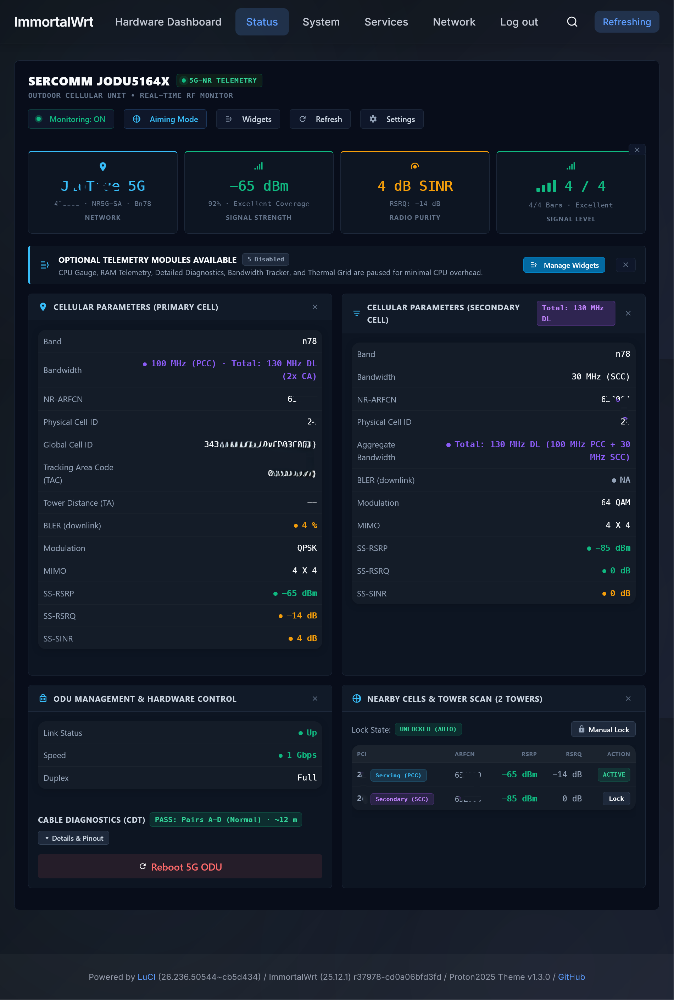
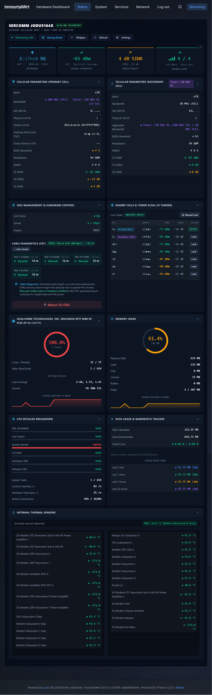
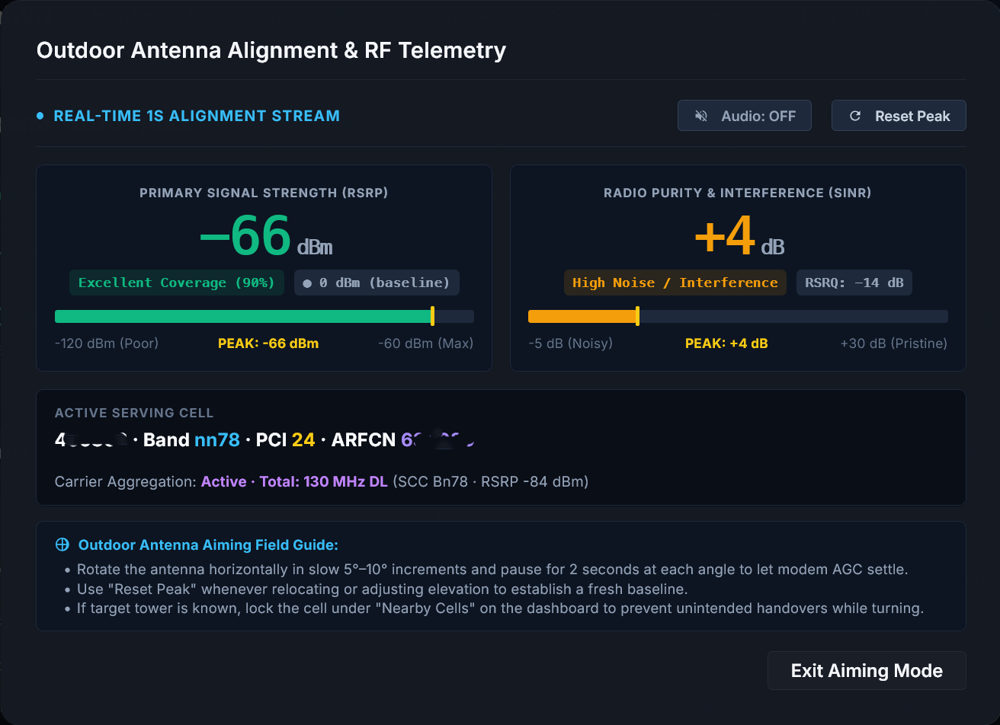
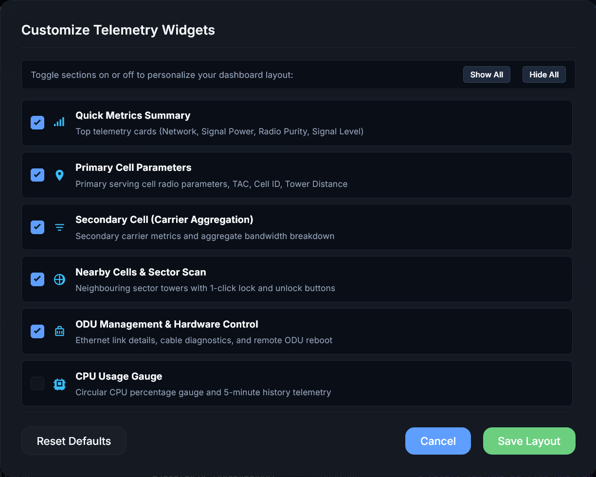
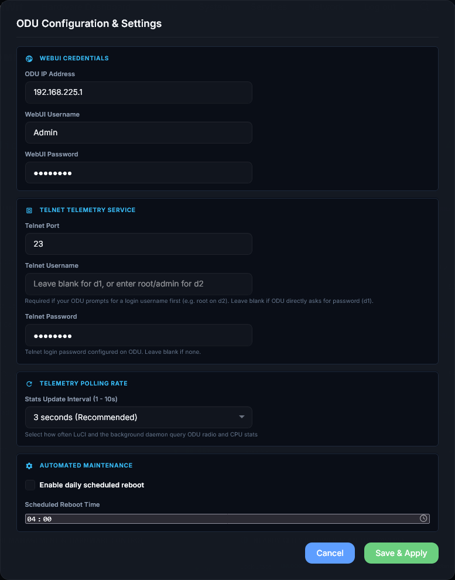
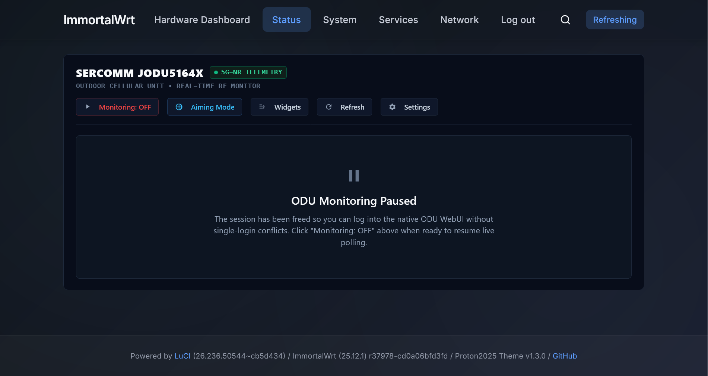

<div align="center">

# luci-app-jodu5164x-status

### Real-Time 5G Dashboard for Sercomm JODU5164x ODUs (JODU51641 / JODU51642) on OpenWrt

[](https://github.com/MrManiesh/luci-app-jodu5164x-onyx/releases)
[-success.svg)](https://openwrt.org)
[](https://immortalwrt.org)
[](https://github.com/anishthevictorious)
[](https://t.me/Zeetron)

A modern, responsive, and theme-adaptive LuCI web dashboard extension for **Sercomm 5G Outdoor Units (ODU)** (**JODU51641** and **JODU51642**).

</div>

---

> [!CAUTION]
> ### ⚠️ Educational & Research Disclaimer
> **This software is developed strictly for educational, research, and personal hobbyist purposes.**
> Features such as cell locking, rebooting, and diagnostic queries interact with your modem's internal CLI (`cricli` and `atcli`) and native WebUI. While commands are sent in volatile memory and do not modify persistent firmware partitions, **use this software at your own risk**.

---

## 📸 Screenshots

| **Minimalist View (Default)** | **Full Expanded Telemetry** |
| :---: | :---: |
| [](screenshot/default_or_few_widgets_visible.png) | [](screenshot/all_widgets_visible_and_main_page.png) |
| *Glanceable RF indicators & primary cell telemetry* | *Comprehensive RF, CA, Nearby Cells, CDT & SoC metrics* |

| **Antenna Aiming & Audio Beeper** | **Modular Widget Customizer** |
| :---: | :---: |
| [](screenshot/Outdoor_Antenna_Alignment_and_RF_Telemetry.png) | [](screenshot/Customize_Telemetry_Widgets.png) |
| *Real-time peak tracking & pitch-modulated Web Audio* | *Toggle and personalize visible telemetry cards* |

| **ODU Configuration & Credentials** | **Native WebUI Session Handoff** |
| :---: | :---: |
| [](screenshot/ODU_Configuration_and_Settings.png) | [](screenshot/turned_off_monitoring.png) |
| *Configure host, WebUI/Telnet authentication & polling* | *1-Click pause to release single-session WebUI lock* |

---

## ✨ Features

- 📡 **Real-Time 5G Radio Metrics**: Live monitoring of **SS-RSRP**, **SS-RSRQ**, **SS-SINR**, consolidated signal quality score, modulation (DL/UL QAM), MIMO layers, Block Error Rate (**BLER %**), and NR-ARFCN channel.
- 🎨 **Universal Theme-Adaptive UI**: Pure automatic detection adapting seamlessly to all router themes (Material, Bootstrap Light/Dark, Argon, Proton2025, Aurora). Instant light/dark card contrast with dynamic typography.
- 🛰️ **Cell & Tower Identifiers**: Automatic parsing of **Tracking Area Code (TAC)** (hex & dec), **Global Cell ID (NCI)** (hex & dec for CellMapper lookup), and **Physical Cell ID (PCI)**.
- ⚡ **Carrier Aggregation (CA)**: Secondary component carrier (SCC) radio parameters and dynamic total aggregate downlink bandwidth calculation ($BW_{PCC} + BW_{SCC}$).
- 🎯 **Outdoor Antenna Alignment Mode**: Real-time 1-second high-contrast aiming mode with hands-free pitch-modulated **Web Audio beeper**, baseline tracking, peak memory, and tower handover warnings.
- 🔒 **Cell & Frequency Locking**: 1-click tower locking from the nearby sector scan, manual PCI & ARFCN locking, and 1-click unlock to restore auto cell selection.
- 📡 **Nearby Cell Scanner**: Comprehensive scan of detected neighboring sectors with PCI, ARFCN, signal quality levels, and active serving/secondary tags.
- 📊 **Hardware & System Diagnostics**: 
  - 1-Click remote ODU reboot with automatic reconnection monitoring.
  - Realtek PHY **Cable Diagnostics (CDT)** testing all 4 twisted pairs for status and length.
  - Multi-zone internal thermal grid (CPU, Modem, Sub-6 RF, Power Amplifiers).
  - CPU and RAM utilization gauges with real-time sparklines.
  - Session upload/download traffic counter with historical rolling windows.
- ⏸️ **WebUI Session Handoff**: 1-click **Monitoring: ON / OFF** button to pause LuCI polling and release the single-login session lock for the native ODU WebUI.
- ⚙️ **Configurable Settings**: In-dashboard modal for ODU IP, WebUI credentials, Telnet port/credentials, polling rate (1s–10s), and automated daily scheduled reboot.

---

## 🚀 Installation

### Direct 1-Line Quick Install (OpenWrt 24.10+ / ImmortalWrt)

Run the following command directly on your router via SSH:

```sh
cd /tmp && uclient-fetch -O luci-app-jodu5164x-status-3.2.1-r1.apk https://github.com/MrManiesh/luci-app-jodu5164x-onyx/releases/download/v3.2.1/luci-app-jodu5164x-status-3.2.1-r1.apk && apk add --allow-untrusted ./luci-app-jodu5164x-status-*.apk
```

### Restart Services (Recommended)

```sh
/etc/init.d/rpcd restart
/etc/init.d/uhttpd restart
/etc/init.d/jodu5164x-updater restart
```

### 📍 Where to Find in LuCI After Installation

After installation and restarting services, refresh your browser page and open:
> 👉 **Onyx Tools** $\rightarrow$ **5G ODU Telemetry**

---

## 👑 Original Author & Attribution

> [!NOTE]
> ### 🌟 Heartfelt Credit to the Original Creator
> Sincere credit, gratitude, and recognition go to **Anish** ([@anishthevictorious](https://github.com/anishthevictorious/))
> 
> **This repository is an evolved continuation built upon Anish's foundational work**, introducing:
> - **Redesigned New UI**: High-contrast, glanceable telemetry cards, glowing KPI ribbons, and dynamic responsive auto-fit grid.
> - **Modular Dynamic Widgets**: Toggable widgets with personalized dashboard layout persistence and on-demand resource querying.
> - **Outdoor Antenna Alignment Mode**: Real-time 1-second alignment polling with hands-free pitch-modulated Web Audio beeper.
> - **Advanced Cellular Insights**: 5G TAC & NCI formatting, and multi-band Carrier Aggregation (CA) aggregate bandwidth calculations.
> - **Performance Architecture**: Dedicated background caching daemon (`jodu5164x-updater`) running under `procd` ensuring instantaneous sub-50ms LuCI execution without browser timeout risks.

<div align="center">

| Role | Author | Links |
|:---|:---|:---|
| 🏛️ **Original Creator (Base Project)** | **Anish** | [](https://github.com/anishthevictorious) [](https://t.me/anish_iii)  |
| 🎨 **UI Overhaul & Feature Additions** | **Manish Matwa Choudhary** | [](https://github.com/MrManiesh) [](https://t.me/Zeetron) |

</div>

---

## 📄 License & Maintainer

- **License**: All Rights Reserved. See [LICENSE](LICENSE) for details.
- **Original Base Project**: Created by [Anish (@anishthevictorious)](https://github.com/anishthevictorious)
- **Current Maintainer**: Manish Matwa Choudhary ([@Zeetron](https://t.me/Zeetron) / [@MrManiesh](https://github.com/MrManiesh))
- **Project**: OpenWrt LuCI 5G CPE Dashboard.
